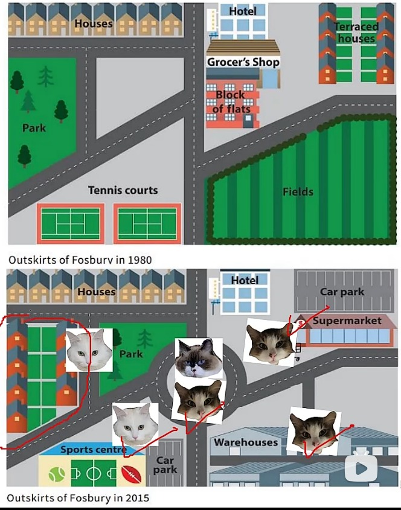
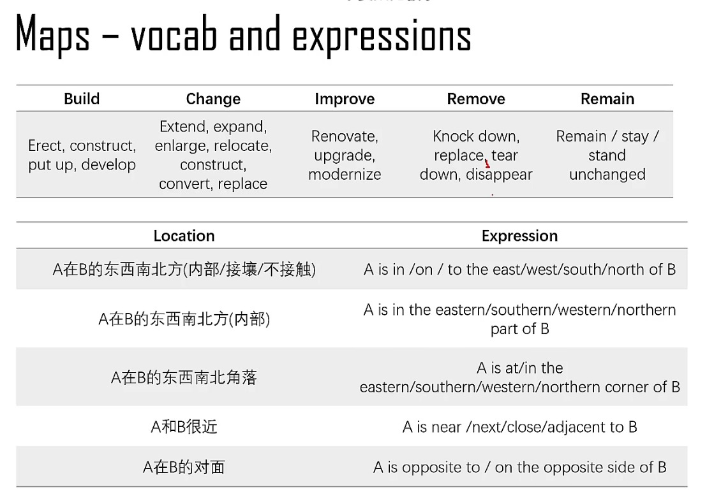

# Maps 🦖  

**Step 1 : point of reference (参考点)**  

Roundabout (circular road) (环形路)  
- **Framework + Conclusion**  
  The maps depict the outskirts of the town Fosbury in 1980 and 2015, and the urban developments that took place. Overall, new industrial and commerical features were added, while recreational and residential facilities were renovated.

**Step 2 : locate major changes (主要变化)**  

- **Roundabout (circular road)  + Industrial - warehouses + Commerical - supermarket**  
  The most prominent change is a new roundabout in the center of the town, replacing the intersection that connected roads to all directions. In addition, new industrial and commercial features were added : the empty fields in the southeastern corner were converted into warehouses, a new industrial facility in the town; in the northeastern corner, flats, houses, and the grocer's shop were demolished, and a new supermarket with a car park (facing the hotel along the road leading north) was built up.

**Step 3 :locate other changes (其他变化)**  

- **Recreational - sports, park  + Residential - houses**  
  There were also extensive renovation to the recreational and residential facilities to the town: 1. the tennis courts in the southwestern corner were upgraded to a sports center with car park; 2. opposite to the long line of houses stretching from the northwestern corner to due north, the large park in the western side of the town surrounded by roads was converted into a new residential zone with terraced houses, facing a smaller new park across the road to its east.

**🌟🌟🌟Maps_expressions**  
